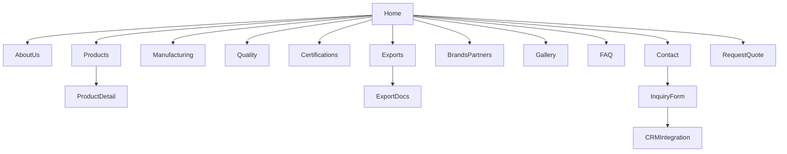

# Siddhi Vinayak Polyester – Website SRS

## Executive Summary  
Siddhi Vinayak Polyester is a 20-year-old Indian B2B polyester yarn manufacturer and trader serving domestic and export markets. This SRS outlines the complete web documentation for a modern React-based frontend to boost its international and national presence. Key features include detailed company history, product catalog (POY/FDY/DTY/ATY, spun yarns, core-spun, etc.), manufacturing and quality pages, certifications, export info, lead capture and CRM integration, multilingual SEO strategy, and advanced UI/UX (including a scroll-animated yarn thread). The site will employ React + Vite, Tailwind CSS, Framer Motion/GSAP for animations, React Router for navigation, React Helmet for meta tags, and React Hook Form for contact/quote forms.  

## Company Overview  
Siddhi Vinayak Polyester (founded circa 2006) was started by a textile-industry family with roots in weaving. Over 20 years, it has grown into a leading polyester yarn mill and trading company in Maharashtra, supplying major Indian brands (e.g. Reliance, Bhilosa, Shandhan, Extea) and exporting globally. The **About Us** section will narrate the founder’s vision, company milestones (e.g. expansions, certifications), and emphasize two decades of trust. Include high-quality photos of the factory, weaving machines, and key personnel. The tone is professional and client-focused, noting core values like quality, reliability, and innovation. 

## Target Audience, Business Goals & KPIs  
**Audiences:**  
- **Domestic textile manufacturers:** garment, knitwear, technical textile, hosiery, denim, industrial fabrics, home textiles producers seeking polyester yarns.  
- **International buyers:** yarn importers, global garment and upholstery producers.  
- **Wholesalers/Traders:** bulk distributors requiring reliable yarn supply.  

**Business Goals:**  
- Expand export markets (Asia, Middle East, Africa, Americas).  
- Increase qualified leads (RFQs, inquiries) from the website.  
- Showcase technical prowess and certifications to build trust.  
- Position Siddhi Vinayak as a premium B2B yarn supplier (both manufacturing and trading).  

**KPIs:**  
- Website traffic and time on page (especially in English and key languages).  
- Number of RFQ/“Request Quote” submissions (goal: 10–20% lift).  
- Conversion rate of visitors to leads (target: >5%).  
- Bounce rate (target: <40%).  
- SEO rankings for targeted keywords (e.g. “polyester yarn manufacturer India”).  
- International engagement (e.g. inquiries from targeted export markets).  

## Sitemap & Navigation  
- **Header Navigation:** Home, About Us, Products, Manufacturing, Quality, Certifications, Exports, Brands & Partners, Gallery, Contact, Quote.  
- **Footer Links:** FAQ, Blog, Resources (whitepapers, brochures), Legal (Terms, Privacy), Social links (LinkedIn, WhatsApp).  
- **User Flows:** Typical buyer journey: Home → Products → Product Detail → Request Quote → Contact. Another flow: Home → Manufacturing/Quality → Certifications (to build trust) → Contact.  



## Pages & Detailed Content  

- **Home:** Hero banner with tagline (e.g. “20 Years of Polyester Yarn Excellence”). CTA buttons like “Our Products” and “Request Quote”. Brief intro about the company’s legacy. Showcase core product categories (FDY, DTY, Spun Yarn) with icons or images. Feature quick links to Certifications and “Our Brands” (e.g. Reliance, Bhilosa). Highlight a rotating marquee: “ISO 9001 Certified” and top markets served. Include an animated yarn-thread effect in the background or a scroll-triggered yarn SVG to draw attention (see *Animation* below).

- **About Us:** Headline (e.g. “About Siddhi Vinayak Polyester – 20 Years of Quality Yarn”). Sections: company history timeline (founding story, milestones), founder’s bio, mission/vision statement. Include factory and office photos. Mention manufacturing capacity, team. CTA to “Our Certifications” and “Contact Us”.

- **Products:** Landing page listing yarn categories: **Filament Yarn** (FDY, POY, Monofilament), **Textured Yarn** (DTY, ATY), **Spun Yarn** (100% polyester and blends), **Specialty Yarns** (Core-spun, Twisted, Flame-Retardant, Recycled). Each category card has a brief description (e.g. *“Filament yarns are continuous polyester filaments used in weaving and knitting”*), an image/icon, and a “View Products” button. Filters: by Yarn Type, Denier/Count range, Application.  

- **Product Detail (Template):**  
  - **Header:** Yarn name (e.g. “Polyester Filament (FDY) 150D/48F”) and brief one-liner.  
  - **Gallery:** High-res image(s) of the yarn cone or spools, possibly video of fabric made.  
  - **Key Specs Table:** Fields such as Material (Polyester 100% or blend), Yarn Form (Filament/Staple/Core-spun), Luster (Bright/Semi-dull/Matte), Denier/Tex/Nm, Filament count (e.g. 48F), Twist (e.g. 0T, S/Z), Tenacity (e.g. 4.5–7.0 g/den, *from supplier data*), Elongation at break (e.g. 12–20%), Shrinkage, Moisture, Color, Finish (Textured/Drawn/Undrawn). Example fields table:

  | **Field**            | **Description**                                                                                 |
  |----------------------|-------------------------------------------------------------------------------------------------|
  | Material             | 100% Polyester (or Polyester/Cotton blend)                                                     |
  | Yarn Type            | FDY (fully-drawn filament)                                                                     |
  | Denier / Count       | 150 D (grams per 9000m)                                                          |
  | Filament / Staple    | Continuous filament yarn                                                                      |
  | Filaments per Yarn   | 48 (number of filaments per yarn bundle)                                                       |
  | Twist               | 0 twist                                                                                         |
  | Luster               | Semi-dull                                                                                       |
  | Tensile Strength     | 5.0 g/den (typical range: 4.5–7.0 g/den)                                         |
  | Elongation at Break  | 15% (typical 12–20%)                                                            |
  | Shrinkage @ 100°C    | < 8%                                                                            |
  | Moisture Content     | < 0.5%                                                                           |
  | Application          | Weaving, knitting, embroidery, sewing (e.g. fabrics, home textiles, industrial textiles)      |
  | Packaging            | 1500m per cone; 12 cones per carton (~20kg)                                      |
  | HS Code (India)      | 5402 (synthetic filament yarn) or 5509 (staple yarn) – subject to duties/AD |
  | Certifications       | ISO 9001, OEKO-TEX Std100, (GOTS if recycled blend)                              |
  | Inquiry              | *“Request Quote” CTA (opens form/modal)*                                                        |

  - **Description:** Technical explanation (e.g. “FDY (Fully Drawn Yarn) is a smooth polyester filament directly used in weaving light fabrics like sarees, linings, and home textiles.”).  
  - **Applications:** List use-cases (e.g. “Ideal for knitwear, shirting, curtains”).  
  - **CTA:** “Request Quote” button (scrolls to form or opens popup).  
  - **Datasheet Download:** Option to download PDF spec sheet (table similar to above).  

- **Manufacturing:** Describe step-by-step process with text and diagrams: 
  1. **Polymerization:** PTA + MEG → PET polymer chips. (Typically ~86% PTA, 100% MEG, small excess.)  
  2. **Melt Spinning:** PET chips are melted and extruded through spinnerets to form POY (Partially Oriented Yarn). Filaments solidify via quench air.  
  3. **Drawing:** POY is drawn (stretched) to orient polymer chains, improving strength and reducing diameter.  
  4. **Texturing:** Drawn yarn (POY) is false-twist textured (twist–heat–cool–untwist) to produce DTY (crimped, elastic). Alternatively, air-jet texturing entangles filaments for a wooly hand.  
  5. **Twisting/Finishing:** Some yarns (e.g. sewing thread) are plied or twisted. Hot melt finishing or coating may add functionalities.  
  6. **Dyeing:** Yarn can be package-dyed or dope-dyed (color masterbatch) for desired hue.  
  7. **Quality Control:** Tensile, elongation, shrinkage, moisture are tested; spin finish (wax/emulsifier) is applied for lubrication. Yarn is wound on bobbins (e.g. 4000–6000 m per tube) and packed.  

  Sample process table:

  | **Step**              | **Process**                                                      | **Notes/Output**                               |
  |-----------------------|------------------------------------------------------------------|------------------------------------------------|
  | Polymerization        | PTA + MEG → PET chips                                            | Chips (petroleum-derived polyester) |
  | Melt Spinning         | Extrude molten PET through spinneret, quench to form filaments | Produces POY (partially-oriented yarn)         |
  | Drawing               | Stretch POY to align polymers                     | FDY (fully drawn yarn) or feed yarn for texturing |
  | Texturing (False-twist)| Twist–heat–cool–untwist filament yarn             | DTY (drawn textured yarn)                      |
  | Texturing (Air-jet)   | Blow air to entangle filament yarns                              | ATY (air-jet textured yarn)                     |
  | Winding               | Wind yarn on cones/bobbins (e.g. 1500m per cone)  | Ready-to-pack yarn packages                    |
  | Dyeing/Finishing      | Apply color masterbatch or package-dye; apply spin finish | Colored yarns; lubricated for processing        |
  | Packing/QC            | Bundle cones into cartons, label; final inspection               | Cartons/pallets shipped                        |

- **Quality & Testing:** Describe lab capabilities (tensile testers, shrinkage ovens, moisture meters). Mention standards (ASTM, ISO) if any. Highlight QC pass rates, consistency. Possibly include a gallery of lab shots.  
- **Certifications:** Show copies/logos of ISO 9001, OEKO-TEX Standard 100, perhaps OHSAS/ISO 14001 if held. Explain each: e.g. “OEKO-TEX Standard 100 ensures yarns are free from harmful substances.” Note: GOTS applies only to organic fibers; virgin polyester cannot be GOTS certified, although recycled blends may qualify under GR or GRS.  
- **Exports:** Outline export markets and terms. Mention that company holds an IEC code and RCMC for exports. List major destinations. Explain export support: e.g. “We provide Certificate of Origin (for preferential duty), Commercial Invoice, Packing List, Bill of Lading/Air Waybill, and any required Inspection Certificate.” Emphasize Incoterms: e.g. typically FOB (Mumbai) or CIF as per contract. Provide example incoterms table (e.g. EXW, FOB, CIF with responsibilities).  

- **Brands & Partners:** Display logos of major yarn suppliers (Reliance, Bhilosa, etc.) as those whose yarn we distribute or co-manufacture. Possibly a brief blurb on collaboration with each (e.g. “Authorized distributor of Reliance Industries’ synthetic yarn range.”).  

- **Gallery:** Photo grid of factory (spinning lines, texturing machines), finished yarn cones, sample fabrics. Include alt text for accessibility.  

- **Contact:** Company address (interactive Google map), phone, email, WhatsApp link. A contact form with fields (Name, Company, Email, Phone, Message), CAPTCHA and submit button. Under it, a link “Request a Quote” that goes to the quote form.  

- **Request Quote:** Dedicated page or anchor to a detailed inquiry form (Company, Product Interest, Quantity, Delivery terms, sample requests). Use **React Hook Form** for validation. Integrate to send data to CRM/email. CTA: “Get Estimate”.  

- **FAQ:** Common questions (MOQ, lead time, sample policy, payment terms, export docs). Example: “What is your minimum order quantity?” (Answer: “Typically 100 kg per item.”) etc.  

- **Blog/Resources:** Publish articles (e.g. “Polyester Yarn vs Cotton Yarn”, “Understanding Denier and Tex”), whitepapers (yarn performance data), news (trade shows, new lines). Focus on SEO (see next section).  

- **Legal & Privacy:** Standard pages with Terms & Conditions, Privacy Policy, Cookie notice (if analytics used).

## Product Taxonomy & Applications  
Siddhi Vinayak’s full product range will be structured by yarn **type and count**:  

- **Filament Yarns:** Continuous synthetic filaments. Includes FDY (fully drawn yarn), POY (partially-oriented yarn), and monofilament. *Uses:* FDY (smooth yarn) is woven/knit into sarees, linings, shear fabrics. POY is generally textured into DTY. Monofilament is used for nets, geotextiles.  

- **Textured Yarns:** Produced by false-twist or air-jet texturing of POY. Includes DTY (draw-textured yarn) and ATY (air-textured yarn). *Features:* DTY is soft, bulky, with stretch; ATY has a wooly/spun-like feel. *Uses:* Elastic activewear, leggings, lingerie, socks, casual knitwear.  

- **Spun Yarns:** Short-staple polyester (100% or blends like poly-cotton, poly-viscose) spun into yarn. *Uses:* Apparel (T-shirts, shirts), denim blends, hosiery, upholstery, home textiles (bedsheets, curtains).  

- **Microfiber & Speciality Yarns:**  
  - **Microfiber (below 1 denier):** Extremely fine, soft, highly wickable – used in intimate apparel, cleaning cloths, sport/athleisure.  
  - **CDP (Cationic Dyeable Polyester):** Modified for bright colors – used in fashion fabrics, sportswear.  
  - **Functional Yarns:** Flame-retardant (for protective clothing), anti-bacterial (for medical/textiles).  
  - **Recycled Polyester (rPET):** Made from PET bottles; sustainable option used in casual wear, bags, furnishings.  
  - **High-Tenacity Yarn:** Extra-strong polyester for industrial use (tire cords, conveyor belts, ropes).  
  - **Low-Shrinkage Yarn:** Minimizes heat shrinkage (for coated fabrics, tents).  

A comparison table of key yarn types and uses:  

| **Yarn Type**         | **Key Features**            | **Common Applications**                              |
|-----------------------|-----------------------------|------------------------------------------------------|
| **FDY (filament)**    | Smooth, strong, lustrous    | Sarees, curtains, linings, technical fabrics |
| **POY**               | Semi-oriented, semi-stiff   | Input for DTY; some industrial uses                  |
| **DTY (textured)**    | Stretchy, bulky, crimped    | Activewear, hosiery, undergarments    |
| **ATY (textured)**    | Wooly hand, knit-like       | Knit tops, babywear, light sweaters                  |
| **Spun Polyester**    | Soft, cotton-like feel      | Casual clothing, denim blends, bedding, upholstery |
| **Microfiber (≥1dtex)**| Ultra-fine, lightweight    | Lingerie, sportswear, cleaning cloths  |
| **CDP (dyeable)**     | Bright colors, cross-dye   | Fashionwear, decor fabrics                           |
| **Recycled Polyester**| Eco-friendly, low-carbon   | All segments (apparel, bags, home textile) |
| **High-Tenacity**     | Industrial strength         | Geotextiles, tire cords, ropes        |
| **Flame-Retardant**   | FR treated                 | Protective clothing, upholstery        |
| **Anti-Bacterial**    | Ag-based finish            | Medical garments, socks, sportswear                  |

Denier/Tex counts will be clearly listed. (Denier = grams per 9,000m, Tex = grams per 1,000m.) We’ll specify count in all product titles/descriptions.  

## Manufacturing Processes  
The **Manufacturing** page will detail each stage, using text, images, and possibly process-flow graphics. Key steps include:  

- **Polymerization:** Purified Terephthalic Acid (PTA) and Mono-Ethylene Glycol (MEG) are esterified and polycondensed to PET chips.  
- **Spinning:** Chips are melted and extruded through spinnerets to form continuous filaments. Quench air cools the filaments into semi-oriented yarn (POY).  
- **Drawing:** The yarn is drawn (stretched) to orient molecules and increase tenacity. (Example: drawing can increase polyester strength several-fold.)  
- **Texturing:** POY is false-twist textured – twisting, heating, then untwisting to create crimps. This yields DTY with bulk and elasticity. Alternatively, air-jet texturing entangles filaments for a fluffy feel.  
- **Winding:** Yarn is wound onto cones/bobbins (typically ~1500m per roll). Spin finishes (lubricants/antistatic) are applied to aid processing.  
- **Dyeing & Finishing:** Package dyeing or dope-dyeing adds color; finishing (e.g. heat-setting) ensures dimensional stability. Quality checks (tensile test, heat-shrink test) are performed on lab equipment.  

A **process table**:  

| **Step**      | **Details**                                                        | **Output/Product**                         |
|---------------|--------------------------------------------------------------------|--------------------------------------------|
| Polymerization| PTA + MEG → PET chips (excess MEG ensures reaction completion)| PET polymer chips                           |
| Melt Spinning | Heat PET chips, extrude through spinneret, cool (quench air)   | Partially-oriented yarn (POY)               |
| Drawing       | Stretch POY (cold or hot drawing)                  | Fully-drawn yarn (FDY)                      |
| Texturing     | False-twist (twist–heat–cool–untwist) or Air-jet      | Textured yarn (DTY or ATY)                  |
| Twisting/Finishing| (Optional) Ply or twist filaments; apply heat/finish             | Speciality yarns (e.g. sewing thread)       |
| Winding       | Wind on cones/bobbins (e.g. 1500m/roll)              | Yarn packages ready for packing             |
| Dyeing/Finishing| Add color masterbatch or package-dye; apply spin finish| Colored yarns with required lubricity       |
| Packing/QC    | Bundle cones into cartons (e.g. 20kg packs); final QC | Palletized cartons, Certified for export    |

## Technical Specifications & Datasheets  
Each product page will include a technical spec table (see above). Additionally, downloadable datasheet templates will be provided, listing: Denier/Tex, filament count, tenacity, elongation, shrinkage, moisture, recommended end-uses, packaging. Example values (from supplier data): Tenacity 4.5–7.0 g/den, Elongation 12–20%, Shrinkage <8%, Moisture <0.5%.  

**HS Codes & Duties:** Yarns are classified under HS 5402 (synthetic filament yarn, non-retail) or 5403/5509 (staple yarn). We will note any applicable duties or anti-dumping measures. For example, India has initiated anti-dumping probes on imported polyester yarn (spun yarn from China/SE Asia in 2020, textured yarn from China in 2025). If duties apply, the site can mention “subject to local import regulations” without specific amounts (as rates change).  

## Packaging, Logistics & MOQ  
**Packaging:** Yarns are delivered on cardboard cones/paper tubes. Typically, 1500–1800m is wound per large cone, 12 cones packed per carton (~20–25 kg net). Cartons are wrapped on pallets with straps. The Freightos guide notes: “ensure appropriate packaging and labeling to avoid damage or delays”. Suitable packaging options (wooden spools for specialty yarns, woven bags for bulk) will be noted.  

**MOQ & Pricing:** Minimum orders are usually around 100 kg per variant. (Bulk buyers may have higher MOQs per contract.) Pricing is custom-quoted based on order quantity and yarn type; however, we can display indicative price ranges or “Price on Request.” For SEO and trust, we might quote a ballpark (e.g. ₹110/kg for standard FDY as per market trend). Bulk pricing tiers (e.g. 1–5T, 5–10T) can be illustrated.  

**Sampling & Inspection:** Outline sample policy (e.g. 2–5 cones can be provided on request). Mention pre-shipment inspection options (e.g. SGS) if available.  

## Testing & Certifications  
Detail available test and quality certifications. For example:  
- **ISO 9001:** Quality management certified.  
- **OEKO-TEX Standard 100:** Yarn tested and certified free of harmful chemicals (applicable to polyester).  
- **Global Organic Textile Standard (GOTS):** Not applicable to virgin polyester (requires organic fibers), but mention GRS (Global Recycle Standard) if selling recycled yarn.  
- **Others:** Any industry-specific approvals (BIS for home textiles, REACH compliance statements).  

A subsection could embed OEKO-TEX and ISO logos. Emphasize the role of certifications in B2B trust (e.g. “OEKO-TEX certifies safety, assuring customers of non-toxicity”).  

## Export Documentation & Incoterms  
Exports require standard documentation. We will outline: Commercial Invoice, Packing List, Certificate of Origin (India Bilateral/Preferential if needed), Bill of Lading or Air Waybill, Insurance Certificate, Letter of Credit/Export Contract, Customs Declaration forms, and any special certificates (e.g. fumigation for wooden pallets). According to Trade.gov and industry guides: “Common textiles export docs include: Commercial Invoice, Packing List, Certificate of Origin, Bill of Exchange (or L/C), Insurance Cert., Export License (if any).” The site will note that exports follow Incoterms: e.g. **FOB (port)** is standard, though CIF or EXW can be arranged. A table of Incoterms (FOB, CIF, DAP etc.) will clarify seller vs buyer responsibilities.  

## SEO & Internationalization  
**Keywords:** Research suggests B2B textile buyers search terms like *“polyester yarn manufacturer India,” “synthetic yarn exporter,” “DTY yarn suppliers,” “textile yarn B2B,”* etc. We will weave these into titles, headings, and copy. Each page will have unique `<title>` and meta description. Example meta tags:  

```html
<title>Polyester Yarn Manufacturer India | Siddhi Vinayak Polyester</title>
<meta name="description" content="Siddhi Vinayak Polyester – 20 years in manufacturing premium polyester yarn (POY, FDY, DTY, Spun). Trusted ISO/OEKO-TEX certified exporter. Contact us for quotes." />
```  

**Multi-language:** The primary site will be in English. A Hindi version (e.g. /hi/) is recommended for domestic reach. Additional languages (e.g. Spanish, Arabic, Chinese) can be added if target markets warrant. Language switch links (EN/HI) will be in the header or footer. Content should localize measurements (kg vs lbs) where appropriate.  

**Analytics & CRM:** Integrate Google Analytics (GA4) to track traffic, user journey, and events (e.g. “Quote Requested”). Use React Helmet to inject tracking scripts. Setup goal funnels (Home→Product→Quote). Integrate a CRM (like HubSpot or Zoho): form submissions trigger lead creation. Add a click-to-WhatsApp chat button (using wa.me link) for instant queries.  

**Accessibility & Performance:** Follow WCAG 2.1 AA guidelines: e.g. color contrast ≥4.5:1 for text, alt text for all images, keyboard-navigable menus, ARIA labels on forms. Target Lighthouse scores: Performance, Accessibility, Best Practices ≥90. Use semantic HTML. Optimize images (compressed WebP) and lazy-load non-critical images.  

## Technology Stack  
- **Framework:** React (via Vite) for fast build.  
- **Styling:** Tailwind CSS (utility-first) for responsive design.  
- **Animations:** Framer Motion and/or GSAP. Use Framer Motion’s `<motion.svg>` for the yarn-thread scroll animation. Example: define an SVG path shaped like a yarn curve and animate its strokeDashoffset on scroll.  
- **Routing:** React Router for client-side navigation.  
- **Meta:** React Helmet to manage `<title>` and meta tags dynamically.  
- **Forms:** React Hook Form for contact/quote forms with validation.  
- **State/Store:** Not critical – simple component state or Context (no heavy data needs).  
- **Internationalization:** i18next or similar for language support (if multi-lang).  
- **Other:** Intersection Observer (or Framer’s useInView) for scroll-triggered reveal animations.  

## Component Hierarchy & Structure  
**Pages:** Home, About, Products (listing), ProductDetail, Manufacturing, Quality, Certifications, Exports, Brands, Gallery, Contact, QuoteForm, FAQ, Blog, Resources, Legal (T&C, Privacy).  

**Key Components:** Navbar, Footer, HeroBanner (with animated yarn SVG), ProductCard, ProductFilter, SpecsTable, Accordion (for FAQ), ImageGallery, CertificationCard, ContactForm, QuoteForm, LanguageSwitcher, TestimonialSlider, CookieConsent, etc.  

**Folder Structure (example):**  
```
src/
  assets/         (images, SVGs, icons)
  components/     
    Navbar.jsx
    Footer.jsx
    HeroBanner.jsx
    ProductCard.jsx
    ProductFilter.jsx
    SpecsTable.jsx
    Accordion.jsx
    Modal.jsx
    ContactForm.jsx
    QuoteForm.jsx
    CertificationBadge.jsx
    // ... etc.
  pages/
    Home.jsx
    About.jsx
    Products.jsx
    ProductDetail.jsx
    Manufacturing.jsx
    Quality.jsx
    Certifications.jsx
    Exports.jsx
    Brands.jsx
    Gallery.jsx
    Contact.jsx
    Quote.jsx
    FAQ.jsx
    Blog.jsx
    Resources.jsx
    Terms.jsx
    Privacy.jsx
  hooks/          (e.g. useAuth, useForm)
  utils/          (helpers, e.g. seo.js for meta)
  App.jsx
  index.jsx
  tailwind.config.js
```

## UI Patterns, Colors & Typography  
A professional B2B look is preferred. Use a clean sans-serif (e.g. *Poppins*, *Inter*, or *Rubik*). Maintain ample white space. Suggested **color palette**: primary teal or navy, secondary orange/gold for accents, neutral greys. For example:  
- Primary: #2c5282 (blue) or #0a5273 (teal).  
- Accent: #dd6b20 (orange) or #d69e2e (yellow/gold).  
- Backgrounds: #f7fafc (light gray), #ffffff.  
- Text: #2d3748 (dark gray).  

Buttons and links can use the accent color. Ensure focus states and hover states are distinct. Use of brand colors (orange or saffron, if in logo) can reinforce identity.  

**Imagery:** Use high-res photos of yarn cones, weaving looms, fabrics. Incorporate yarn visuals cohesively:  
- The **hero** might show a stylized yarn or fabric.  
- Product pages will have clear yarn cone images (see example image below).  
- Background patterns (subtle) of interlaced thread or weaving patterns can add texture.  

```markdown
 *Sample yarn imagery can enrich the design. For example, hero sections may feature high-quality photos of yarn spools or fabric rolls to highlight product texture. This visual cue reinforces the polyester yarn focus and premium quality.*  

 *Close-up shots of yarn or fiber (e.g. neutral-colored spools) can be used in banners or section backgrounds. Overlaying them with quality certifications (OEKO-TEX, ISO 9001) emphasizes safety and trust.*  

 *Product catalog and detail pages will showcase yarn cones (as in this image) so buyers can see color and count. Each product image is paired with specs (denier, length, packaging) and a quote CTA.*  

 *For export packaging, images or diagrams can illustrate how yarn cartons and pallets are prepared. Proper packing (e.g. shrink-wrap, strapping) ensures goods arrive intact.*  
```

(*Images above are illustrative examples of yarn spools and thread.*)

## Responsive & Accessibility  
The site will be fully responsive: breakpoints at Tailwind defaults (sm: 640px, md: 768px, lg: 1024px, xl: 1280px). Mobile design prioritizes contact info and easy tap targets (phone, WhatsApp). Navbar will collapse into a hamburger menu on small screens.  

Accessibility (WCAG 2.1 AA): contrast of 4.5:1 or higher for text; all images have meaningful alt text; form fields have labels; keyboard navigation is fully supported. Performance goals: First Contentful Paint <2s, LCP <2.5s, CLS<0.1, using techniques like preloading hero image, code splitting, and Tailwind’s JIT. 

## Animations & Interaction  
Key animation: a **scroll-animated yarn thread**. For example, a thin SVG path shaped like a swirling thread can be drawn progressively as the user scrolls, implemented with Framer Motion or GSAP ScrollTrigger. Other motions: fade-in sections on scroll, subtle button hover scales, image sliders for testimonials, and a rotating banner of brand logos. Animations should be smooth (60fps) but not distract from content.  

## Development Effort & Roadmap  
**Estimated components/pages:** ~15 pages, ~25–30 reusable components. MVP (Phase 1) could include Home, About, Products listing & detail, Contact/Quote, and key informational pages (Manufacturing, Quality). Phase 2 adds Blog, Resources, multi-language, and advanced animations. Phase 3 might include a customer portal or live chat.  

**Effort Estimate:** Roughly 150–200 story points (about 4–6 person-months by one developer). For example, Home (~10 pts), Product listing/detail (~20), Forms/CRM (~15), animations (~10), content pages (~20), QA/Testing (~20), SEO/GA integration (~10), polish (~10).  

**Testing Plan:** Unit tests (Jest) for components, integration tests for forms. E2E tests (Cypress) for key flows (navigation, form submit). Accessibility audit (axe or Lighthouse), cross-browser testing on modern browsers (Edge, Chrome, Safari) and devices.  

**Deployment:** Static build (Vite) hosted on a CDN via Netlify, Vercel, or AWS Amplify. A CI/CD pipeline (GitHub Actions) will build and deploy on push to main. Use HTTPS/TLS, set up domain (e.g. siddhivinayakpolyester.com), and configure caching/CDN.  

## Phased Roadmap  
- **MVP:** Core site, essential pages (Home, About, Product catalog, Contact), mobile layout, basic animations, English content.  
- **v1:** Full product lines and data, detailed content (Manufacturing, Quality, Export sections), SEO optimizations, bilingual support (English/Hindi), enhanced animations (yarn scroll), analytics/CRM integration.  
- **v2:** Blog and resources, multi-currency quoting, additional languages, AI chatbot or live chat integration, possible customer login area, continuous improvement based on analytics.  

This SRS document provides a comprehensive guide for designing and building the Siddhi Vinayak Polyester website, ensuring all stakeholder requirements and best practices are covered.  

**Sources:** Industry and textile references (market intelligence, trade regulator notices, export guides) have been cited throughout to ensure accuracy.